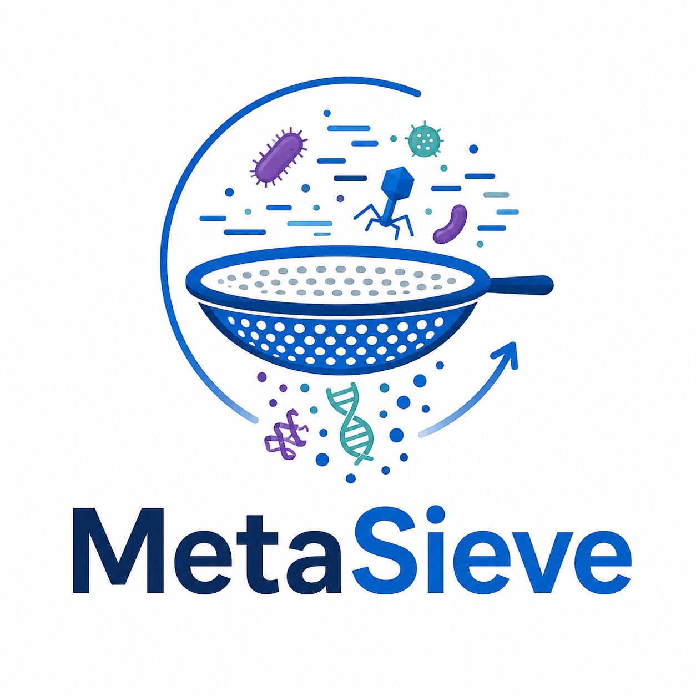
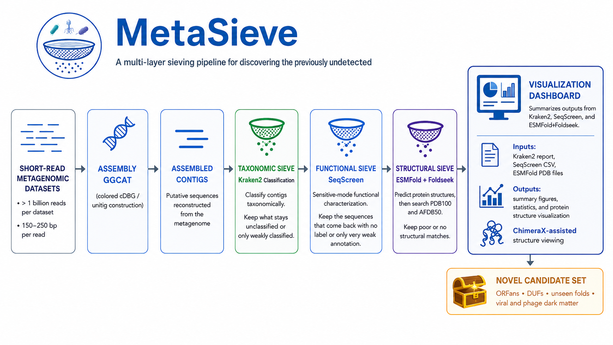

# MetaSieve


## Overview of MetaSieve

**MetaSieve** is a hierarchical metagenomic bioprospecting workflow designed to identify potentially novel proteins from short-read sequencing data. 
The pipeline progressively filters assembled contigs using taxonomic classification, sequence- and function-based characterization, and structural similarity searching to identify ORFans and other proteins that remain poorly characterized even at the structural level.

## Team 
Dr. Todd Treangen, Rice University\
Dr. Jennifer Lu, The Johns Hopkins University\
Hiba Ben Aribi, Tunis El Manar University\
Felix Quintana, Rice University\
Natalie Kokroko, Rice University\
Jingyue Wu, Baylor College of Medicine\
Mohamed Abdelrahim

## Workflow overview


### Software requirements

| Stage           | Tool | Notes |
|-----------------| --- | --- |
| Assembly        | [GGCAT](https://github.com/algbio/GGCAT) | Paired-end short reads → maximal unitigs (`unitigs.fasta`) |
| Taxonomy        | [Kraken2](https://github.com/DerrickWood/kraken2/) | `--unclassified-out` FASTA is fed to SeqScreen |
| Functions       | [Seqscreen](https://gitlab.com/treangenlab/seqscreen) | Fast mode; keep queries with no taxid and no UniRef/UniProt hit |
| (WIP) Structure | Hugging Face [ESMFold](https://esmatlas.com/) | `transformers` + PyTorch; default `facebook/esmfold_v1` |
| Orchestration   | Python ≥ 3.10 | Host binaries on PATH (`ggcat`, `kraken2`, `seqscreen`) |


Raw paired-end short reads are assembled into unitigs and classified with
Kraken2. Unclassified sequences come from Kraken2 `--unclassified-out` and
are screened with SeqScreen (fast mode). Only queries that SeqScreen did
not assign a taxid **and** did not hit UniRef/UniProt are six-frame
translated. Those protein sequences are folded with Hugging Face ESMFold.
Every PDB is named and indexed so it traces back to the originating unitig
and ORF.




## Required Data
1. [Kraken2 Database: k2\_pluspf\_20260626.tar.gz](https://benlangmead.github.io/aws-indexes/k2): 
2. [Wastewater Metagenomic dataset 1](https://www.ncbi.nlm.nih.gov/sra/SRX34378765[accn]): 456.3G bases
3. [Wastewater Metagenomic dataset 2](https://www.ncbi.nlm.nih.gov/sra/SRX34378760[accn]): 488.7G bases
4. [Cacao Soil Metagenomics](https://www.ncbi.nlm.nih.gov/sra/SRX34351257[accn]): 25.6G bases

## Command Lines

```
 prefetch \
    SRR000001 \
    --max-size 40g 
 fasterq-dump \
    --temp $TMPDIR \
    --split-files SRR000001
 ggcat \
    -k 31 \
    -j $THREADS \
    -o SRR000001_ggcat \
    SRR000001_1.fastq.gz \
    SRR000001_2.fastq.gz \
 kraken2 \
    --db $KRAKEN_DB \
    --threads 16 \
    --confidence 0.01 \
    --report SRR000001_scaffolds.k2report \
    --unclassified-out SRR000001_k2unclassified.fa \
    --output SRR000001_scaffolds.k2 
    SRR000001_scaffolds.fasta
 seqscreen \
    --fasta SRR000001_k2unclassified.fa \
    --databases SeqScreenDB_23.4 \
    --working seqscreen_out \
    --threads 16 \
```

## Quick start

```bash
python main.py \
    --reads 'data/*_{1,2}.fastq.gz' \
    --kraken_db /data/dbs/kraken2 \
    --seqscreen_db /data/dbs/seqscreen_databases \
    --threads 16 \
    --outdir results
```

## Dashboard Summary 
MetaSieve comes with a dashboard for visualization of the Kraken2, SeqScreen, and ESMFold results. The dashboard requires output from all three programs: 
1) Kraken2 report file (not output file)
2) SeqScreen CSV file
3) ESMFold Protein Structure PDB Files

From these files, the dashboard will provide multiple figures and statistics summarizing the combined information. Using [Chimera](https://www.cgl.ucsf.edu/chimerax/download.html), the dashboard also provides protein structure prediction and visualization. 

For more information, see [Dashboard's README](https://github.com/collaborativebioinformatics/Metasieve/tree/main/dashboard).

[Example MetaSieve Dashboard](https://github.com/user-attachments/assets/de91fa85-2920-467b-98e3-8a4ea7083ec9)

## Ongoing/Upcoming Projects (Updated 11AM CST 2026/08/28)
1. Incorporate human genome removal (bowtie2 against T2T) pre-assembly/classification
2. Compare assembly pre/post Kraken2 classification
3. Compare megahit vs. metaspades vs. ggcat for assembly 
