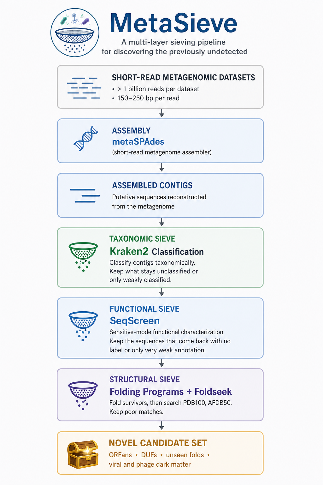

# Metasieve

Mining environmental metagenomes for deeply novel biological sequence and structure

This is a metagenomic bioprospecting workflow designed to identify
environmental DNA and protein sequences that remain unexplained after
taxonomic, functional, and structural database searches.

## Team 
Dr. Todd Treangen\
Dr. Jennifer Lu\
Hiba Ben Aribi\
Francesco Picchi\
Felix Quintana\
Natalie Kokroko\
Jingyue Wu\
Mohamed Abdelrahim


## Software Requirements
Metaspades\
Kraken2\
Seqscreen\
ESMFold\
Foldseek

## Workflow Overview




## Required Data
1. [Kraken2 Database: k2\_pluspf\_20260626.tar.gz](https://benlangmead.github.io/aws-indexes/k2): 
2. [Wastewater Metagenomic dataset 1](https://www.ncbi.nlm.nih.gov/sra/SRX34378765[accn])
2. [Wastewater Metagenomic dataset 2](https://www.ncbi.nlm.nih.gov/sra/SRX34378760[accn])

## Command Line
```
 prefetch \
    SRR000001 \
    --max-size 40g 
 fasterq-dump \
    --temp $TMPDIR \
    --split-files SRR000001
 spades.py \
    -1 SRR000001_1.fastq.gz \
    -2 SRR000001_2.fastq.gz \
    --meta \
    -o SRR000001_spades 
 kraken2 \
    --db $KRAKEN_DB \
    --threads 16 \
    --confidence 0.01 \
    --report SRR000001_scaffolds.k2report \
    --unclassified-out SRR000001_k2unclassified.fa \
    --output SRR000001_scaffolds.k2 
    SRR000001_scaffolds.fasta
```
